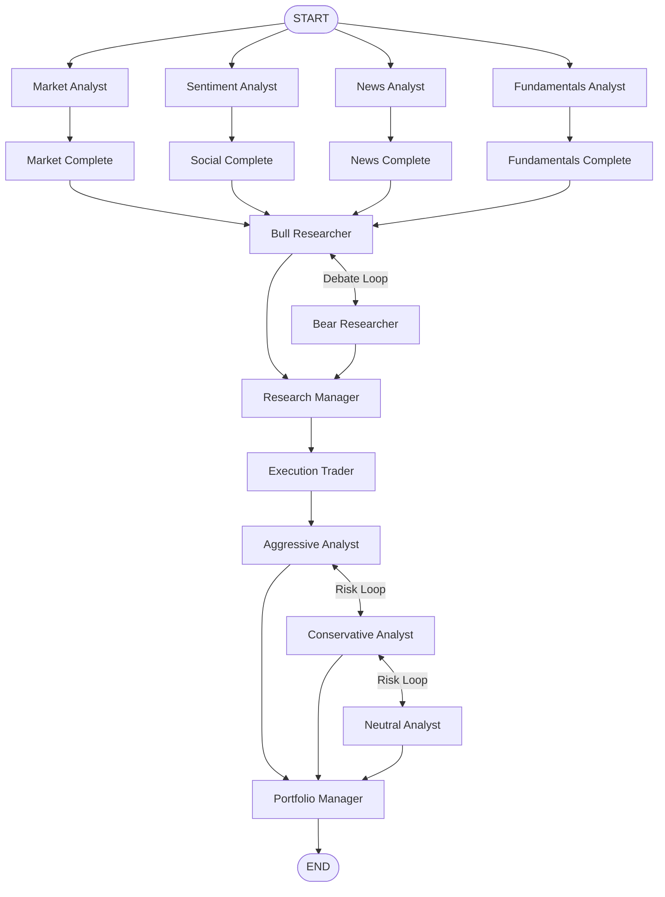

# LangGraph State Flow

## State Graph Schema (`AgentState`)

The global execution state is defined in `tradingagents/agents/utils/agent_states.py`:

```python
class AgentState(TypedDict):
    # Routing & Context
    company_of_interest: str
    trade_date: str
    asset_type: str
    past_context: str
    
    # Isolated Analyst Message Channels
    market_messages: Annotated[list, add_messages]
    social_messages: Annotated[list, add_messages]
    news_messages: Annotated[list, add_messages]
    fundamentals_messages: Annotated[list, add_messages]
    
    # Generated Analyst Reports
    market_report: str
    sentiment_report: str
    news_report: str
    fundamentals_report: str
    
    # Research Debate State
    investment_debate_state: InvestDebateState
    investment_plan: str
    
    # Trader & Risk State
    trader_investment_plan: str
    trader_proposal: Optional[TraderProposal]
    risk_debate_state: RiskDebateState
    
    # Final Output
    final_trade_decision: str
    signal_contract: Optional[SignalContract]
```

---

## State Transition Topology


